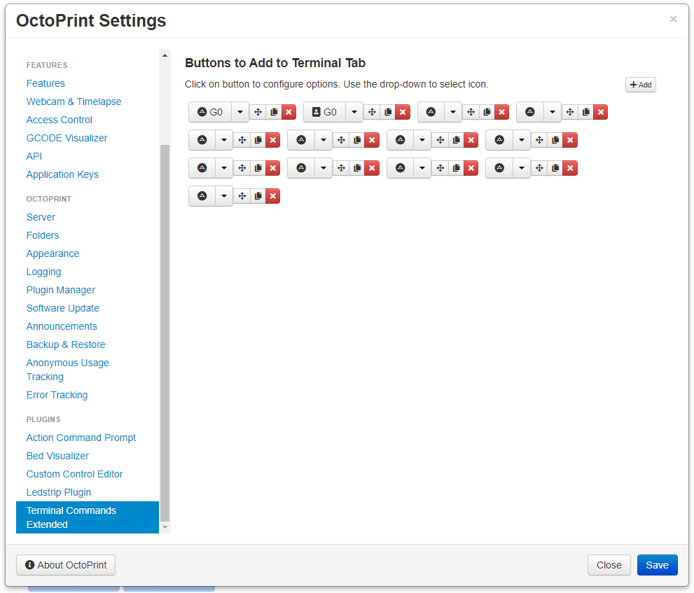
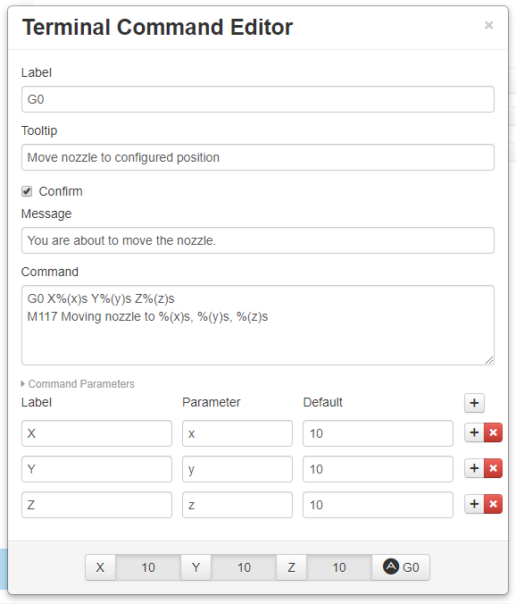
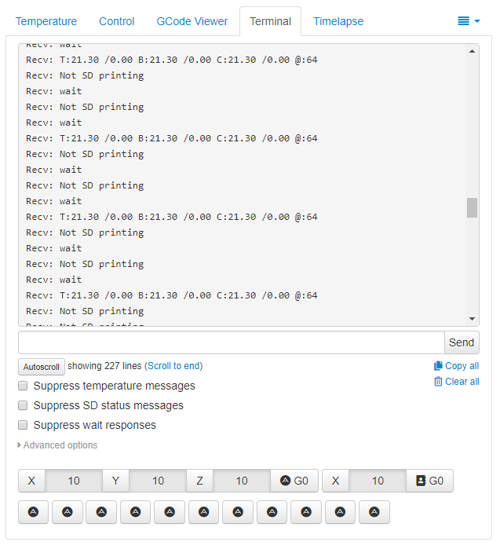

# Terminal Commands Extended

This plugin adds additional command buttons to the Terminal tab of OctoPrint.

## Configuration

Add buttons in settings. Use drop-down on added button to choose the icon and click added button to configure specific options for that button, including the command to run and optional paramaters.

## Screenshots

## Setup

Install via the bundled [Plugin Manager](https://github.com/foosel/OctoPrint/wiki/Plugin:-Plugin-Manager)
or manually using this URL:

    https://github.com/jneilliii/OctoPrint-TerminalCommandsExtended/archive/master.zip

## Most Recent Changelog

**[0.1.6](https://github.com/jneilliii/OctoPrint-TerminalCommandsExtended/releases/tag/0.1.6)** (11/21/2020)

**Added**
* line break option for more formatting flexibility
* width and offset scaffolding compliant with [bootstrap 2 fluid grid system](https://getbootstrap.com/2.3.2/scaffolding.html#fluidGridSystem)
* release channels for OctoPrint 1.5.0+ for future rc testing, similar to OctoPrint as described [here](https://community.octoprint.org/t/how-to-use-the-release-channels-to-help-test-release-candidates/402)

**Updated**
* knockout sortable library for OctoPrint 1.5.0 compatibility

### [All releases](https://github.com/jneilliii/OctoPrint-TerminalCommandsExtended/releases)

## Get Help

If you experience issues with this plugin or need assistance please use the issue tracker by clicking issues above.

### Additional Plugins

Check out my other plugins [here](https://plugins.octoprint.org/by_author/#jneilliii)

### Sponsors
- Andreas Lindermayr
- [@Mearman](https://github.com/Mearman)
- [@TheTuxKeeper](https://github.com/thetuxkeeper)
- [@tideline3d](https://github.com/tideline3d/)
- [SimplyPrint](https://simplyprint.dk/)
- [Andrew Beeman](https://github.com/Kiendeleo)
- [Calanish](https://github.com/calanish)
- [Lachlan Bell](https://lachy.io/)
- [Johnny Bergdal](https://github.com/bergdahl)
- [Leigh Johnson](https://github.com/leigh-johnson)
- [Stephen Berry](https://github.com/berrystephenw)
- [Guyot François](https://github.com/iFrostizz)
- [Steve Dougherty](https://github.com/Thynix)
- [Flying Buffalo Aerial Photography](http://flyingbuffalo.info/)
- Sam Fingard
## Support My Efforts
I, jneilliii, programmed this plugin for fun and do my best effort to support those that have issues with it, please return the favor and leave me a tip or become a Patron if you find this plugin helpful and want me to continue future development.

 

<small>No paypal.me? Send funds via PayPal to jneilliii&#64;gmail&#46;com</small>